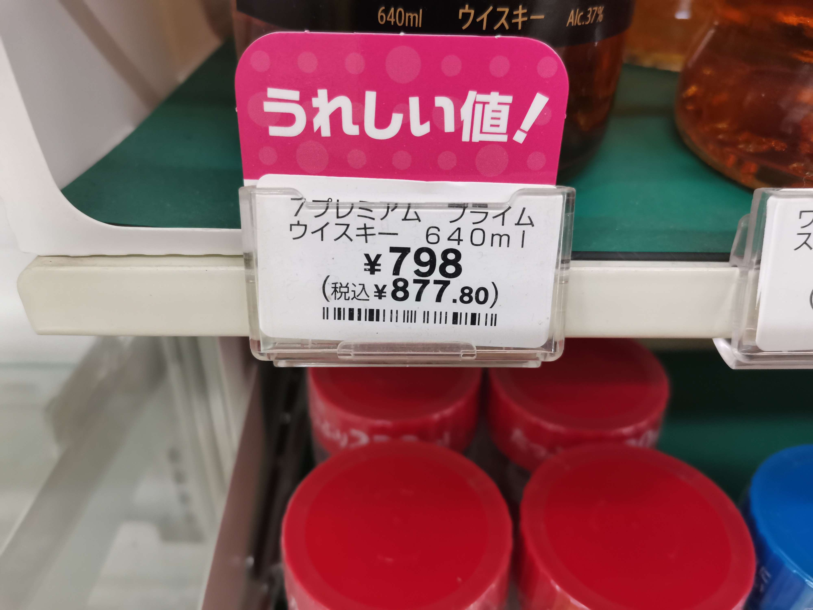

# 📦 Price Tag Detection & OCR (YOLO + Tesseract)

This project uses a custom-trained YOLOv11 model to **detect price tags** from a webcam feed, then uses **Tesseract OCR** to extract the price (in Japanese Yen) and convert it to **any currency** in real time.

## ✨ Features

- ✅ Real-time price tag detection using YOLO
- 🔍 Extracts only the **numeric price** using OCR + regex
- 💱 Automatically converts from JPY to any currency
- 🖼️ Overlays result directly on video feed (OpenCV)
- 🔤 Supports Japanese + English OCR with `pytesseract`
- 📅 Update currency everyday (support realtime updata) with 🍃Airflow + 📡Kafka

## 🖼️ Example Output

From this image:



You get this overlay:

```
YEN 789 / THB 178.46
```

## 🛠️ Requirements

- Python 3.11+ 🐍
- [Tesseract OCR](https://github.com/tesseract-ocr/tesseract)
- Webcam or USB camera 📷
- Nvidia cuda 12.8

### 🔧 Python packages

Install with pip:

```bash
pip install opencv-python pytesseract ultralytics cvzone numpy
```

## 📁 File Structure

```
Pricetag_Dectection/
├── datapipeline             #update currency rate
├── Yolov11_modifly          # Main detection + OCR script
├── README.md                # Project documentation
```

## 🚀 How to Run

## 🐋Docker setup (for realtime update)

1. Run this script to change path:

```bash
cd "E:/Pricetag_dectection/datapipeline"
```

2. Docker compose initialize

```bash
docker compose up
```

3. Run http://localhost:8080/ to open webserver for run DAG

## ⌨️For main program

1. Install dependencies
2. Make sure Tesseract is installed and path is correct in the script:

```python
pytesseract.pytesseract.tesseract_cmd = r'E:\scantext\Tesseract-OCR\tesseract.exe'
```

3. Run the main script:

```bash
python realtime_test.py
```

4. Press `Q` to quit.

## 🔎 How It Works

1. **YOLOv11** detects bounding boxes around price tags from the webcam feed.
2. Each detected box is cropped and passed to **Tesseract OCR**.
3. A regex filters out unwanted text, extracting only a valid numeric price.
4. The price in Yen is converted to USD using a fixed exchange rate.
5. The result is displayed on top of the bounding box.

## 📐 OCR Extraction Logic

We use a regex pattern like this:

```python
[¥￥]?\s?(\d{2,5}(?:,\d{3})?)
```

This captures:

- `¥2238`
- `2238円`
- `¥ 2,238`

But **ignores** extra product text or tax-included lines.

## 📌 Notes

- Works best with clear price tags in front-facing view
- For more accurate OCR, adjust image preprocessing (thresholding, grayscale)
- You can enhance by adding:
  - Auto exchange rate via API
  - Product classification
  - Saving detection history

## 🧠 Acknowledgments

- YOLOv11 from [Ultralytics](https://github.com/ultralytics/ultralytics)
- OCR by [Tesseract OCR](https://github.com/tesseract-ocr)
- Interface overlays by [cvzone](https://github.com/cvzone/cvzone)
